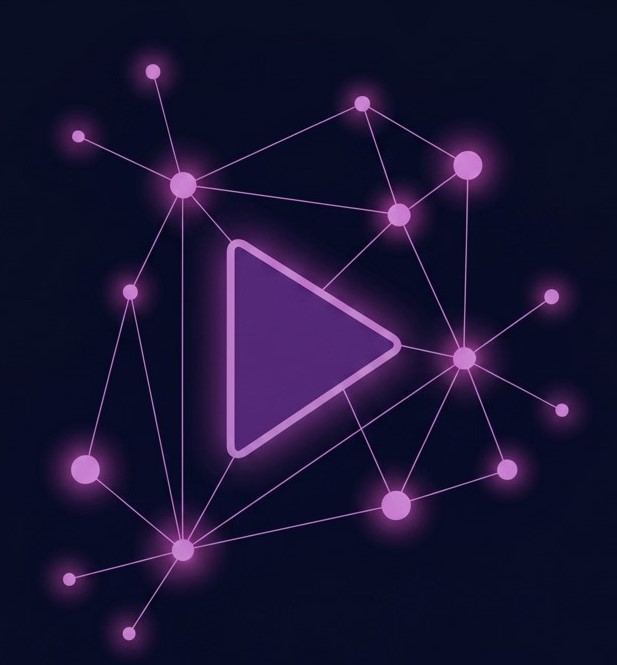

<div align="center">



# INDOGA

**Personalized Anime & Manga Discovery**

</div>

---

## What is this?

Indoga is a web app designed to change how you discover anime and manga. Instead of showing you the same 20 trending titles that everyone has already seen, Indoga helps you dig deeper.

By connecting your AniList/MyAnimeList account, the app analyzes everything - your ratings, planning list, favourites and more - to build a precise taste profile. But it doesn't stop at just giving you a static list of recommendations. Indoga is built around interactive features that turn discovery into a journey.

The goal is simple: to make finding your next favorite series an engaging experience, not just a chore.

---

## 📸 Screenshots

> _Coming soon_

---

## Features

**Discover Tab**

- Up to 100 ranked recommendations with match percentages
- Three view modes: Grid, Wide Grid, List
- Sort by Match %, Community Score, Popularity, or Year
- Click any card to open a dialog with more details

**Filters**

- Switch between Anime and Manga
- Toggle: show sequels, show 18+ content, show from your planning list, show mega-popular titles
- Filter by episode/chapter count, release year, minimum community score
- Tag and genre selectors (include or exclude, multiselect with chips)
- Streaming service filter (Netflix / Crunchyroll)
- Popularity influence (Low / Medium / High)

**Stats Tab**

- Your most liked genres and tags with visual affinity bars
- Hot Takes — where your ratings differ the most from the community
- Watched Timeline — all your completed titles organized by decades

**Compare Tab**

- Enter any AniList or MAL username to compare taste profiles
- Overall match percentage
- Tags you both love, and those which are unique for both of you
- Compare your favourite genres with radar chart
- Biggest differences in your taste

**Other**

- Toast notifications for all errors and actions
- Tooltips for every feature, that explains what it does

---

## How recommendations work

When you request recommendations, the app does the following:

1. **Fetches your list** from AniList or MAL (cached in Redis for 24 hours)
2. **Builds a tag and genre vector** — every title on your list contributes weighted scores based on your rating, rewatches, and whether it's in your favourites, every title you have have in your planning list contributes too, your dropped list contributes negative points.
3. **Scores every anime in the database** using cosine similarity between your vector and each title's tag+genre vector.
4. **Filters** out anything you've already watched, applies your active filters, and normalizes the final scores to 0–1.
5. Returns the **top 100** matches with a "Why Recommended" breakdown showing the top 4 tags that drove each result.

---

## Tech Stack

| Layer          | Technologies                                                                |
| -------------- | --------------------------------------------------------------------------- |
| Frontend       | Next.js 16, React 19, Tailwind CSS v4, shadcn/ui, Recharts                  |
| Backend        | Python 3.11, FastAPI, uvicorn, psycopg2, redis-py, requests, BeautifulSoup4 |
| Database       | PostgreSQL 15                                                               |
| Cache          | Redis 7                                                                     |
| Infrastructure | Docker                                                                      |
| External APIs  | AniList GraphQL API, MyAnimeList REST API v2                                |

---

## Running locally

### Prerequisites

- Docker installed on your machine
- Node.js ≥ 20
- A MyAnimeList API key (free at [myanimelist.net/apiconfig](https://myanimelist.net/apiconfig)) — only needed if you want MAL support

### 1. Clone and configure

```bash
git clone https://github.com/MateuszRadz1kowski/indoga
cd indoga
```

Create a `.env` file in the root:

```env
DB_HOST=localhost
DB_DATABASE=anime_db
DB_USER=postgres
DB_PASSWORD=your_password

REDIS_HOST=localhost
REDIS_PORT=6379

MAL_API_KEY=your_mal_key
```

### 2. Start the backend

```bash
docker compose up --build -d
```

### 3. Set up the database

Connect to the PostgreSQL container and create the table:

```bash
docker exec -it indoga_db psql -U postgres -d indoga_db
```

```sql
CREATE TABLE IF NOT EXISTS public.anime_data
(
    id integer NOT NULL,
    id_mal integer,
    title_english text COLLATE pg_catalog."default",
    season_year integer,
    format text COLLATE pg_catalog."default",
    is_adult boolean,
    genres jsonb,
    tags jsonb,
    recommendations jsonb,
    popularity integer,
    favourites integer,
    mean_score integer,
    description text COLLATE pg_catalog."default",
    episode_number integer,
    cover_image text COLLATE pg_catalog."default",
    trailer_id text COLLATE pg_catalog."default",
    trailer_site text COLLATE pg_catalog."default",
    season text COLLATE pg_catalog."default",
    relations jsonb,
    external_links jsonb,
    status text COLLATE pg_catalog."default",
    banner_image text COLLATE pg_catalog."default",
    creators jsonb,
    CONSTRAINT anime_data_pkey PRIMARY KEY (id)
)
```

Then populate it (takes 10–20 minutes, imports ~10k titles from AniList):

```bash
docker exec -it indoga_backend python3 backend/app/db/ingestion/database_import.py
```

### 4. Start the frontend

```bash
cd frontend
npm install
```

Create `frontend/.env.local`:

```env
NEXT_PUBLIC_API_URL=http://localhost:8000
```

```bash
npm run dev
```

Go to [http://localhost:3000](http://localhost:3000) and log in with your AniList or MAL username.

---

<div align="center">
Built by <a href="https://github.com/MateuszRadz1kowski">Mateusz Radzkowski</a>
</div>
